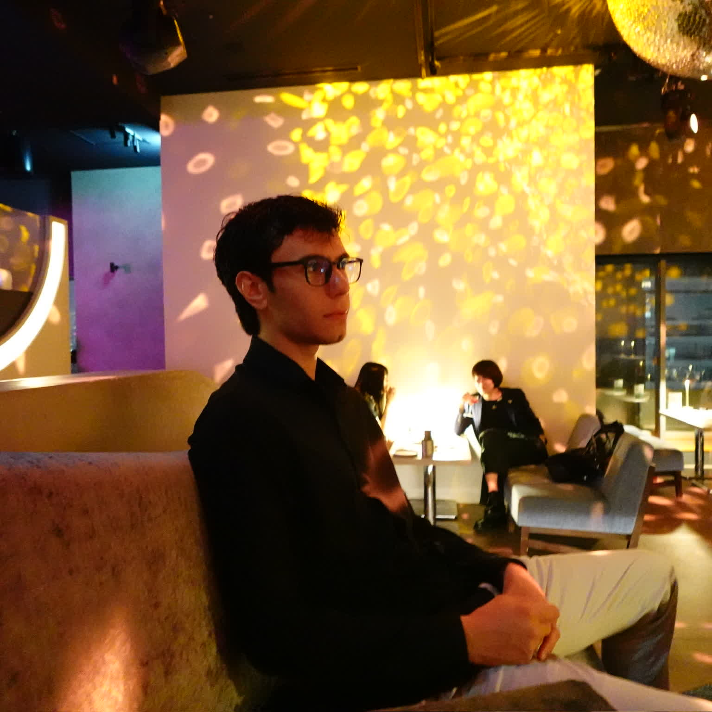
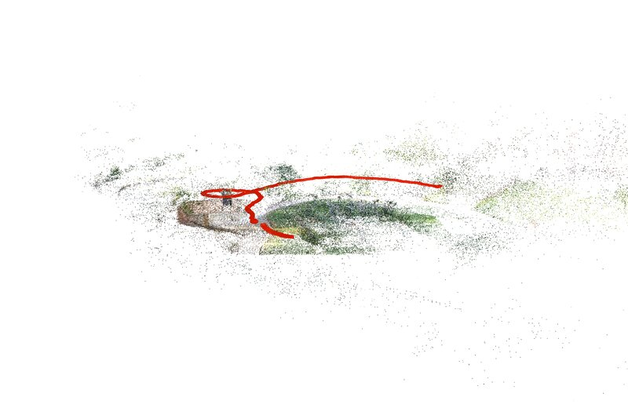
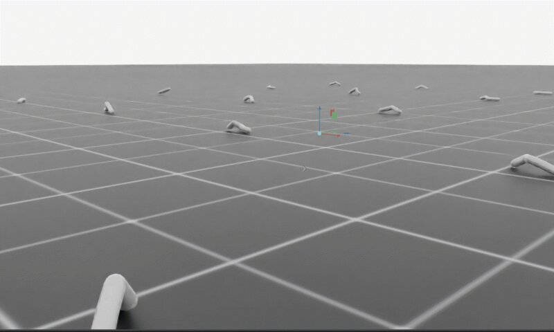
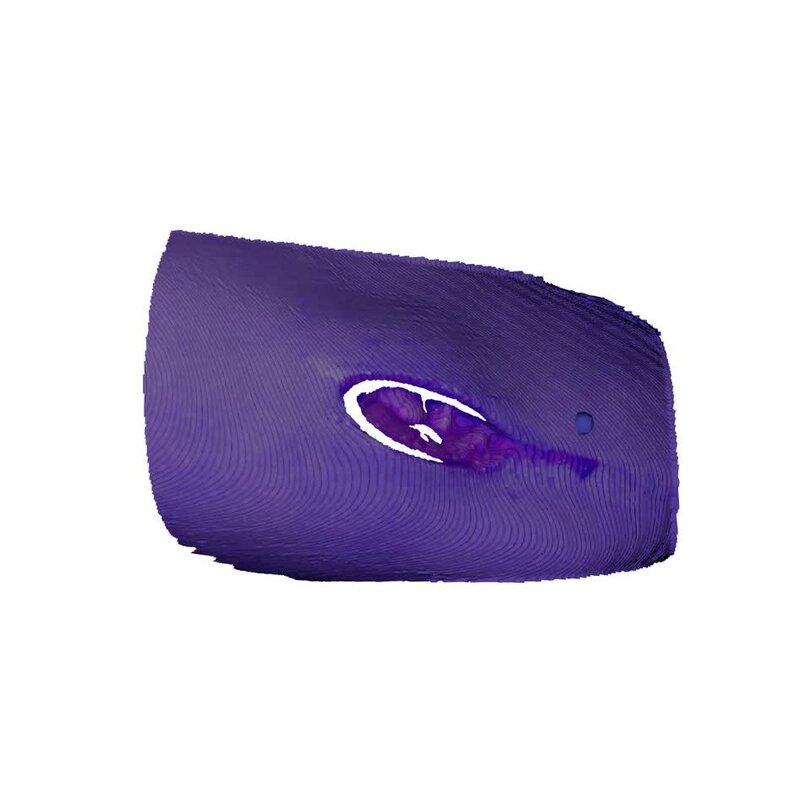
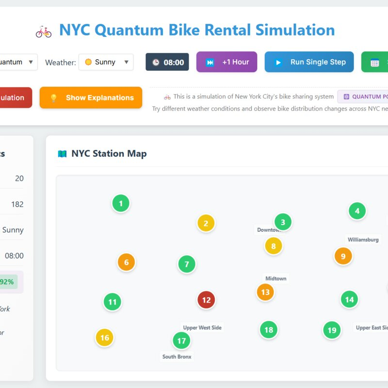
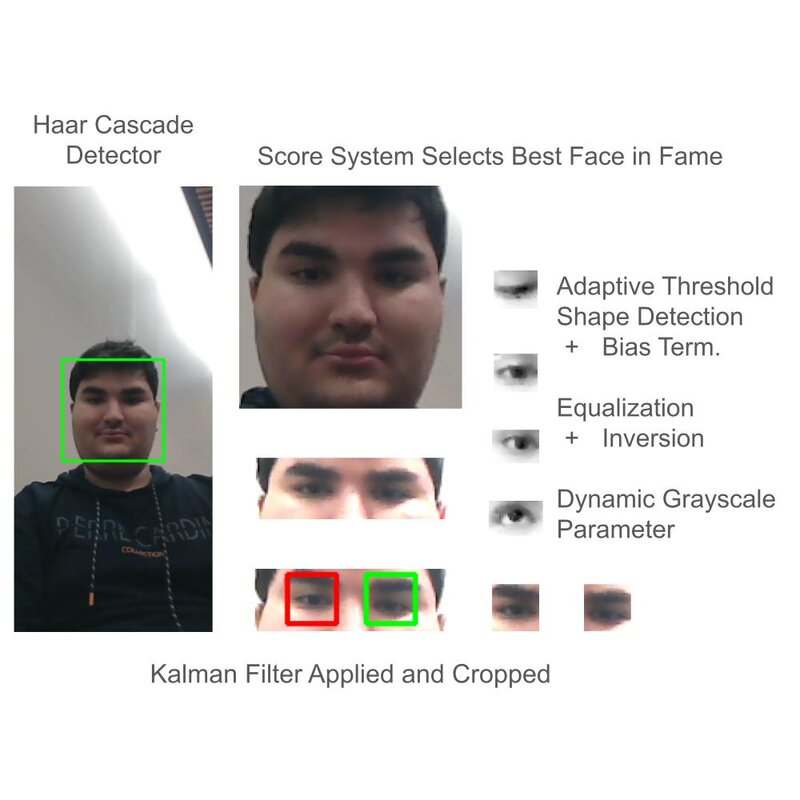
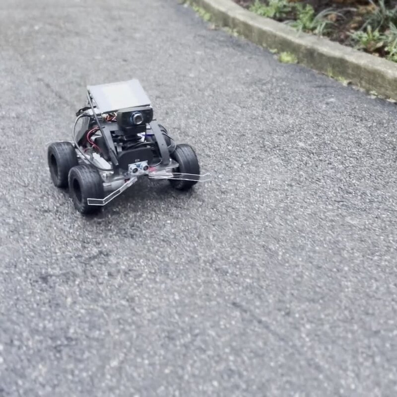
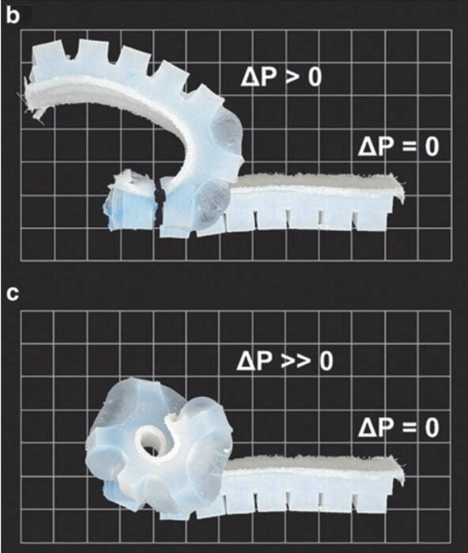

<section id="safa-obuz" class="profile-text">
<h1>Safa Obuz</h1>
<h2 id="robots-vision-and-learning"><em>Robots, Vision, and
Learning</em></h2>

I’m a Computer Vision Research Assistant at the <a
href="https://github.com/VILab-Drexel">Visual Intelligence Lab</a>
advised by <a href="https://liufeng2915.github.io/">Dr. Feng Liu</a> at
Drexel University. I’m largely interested in robotics, computer vision,
mathematics, computer graphics, and simulation.

I am currently working in the sub-field of 3D reconstruction with an
emphasis on dataset and model viability for downstream use cases
(robotics).

<a href="https://github.com/SafaObuz">GitHub</a> | <a
href="https://www.linkedin.com/in/safaobuz/">LinkedIn</a>

</section>

I’m a Computer Vision Research Assistant at the <a
href="https://github.com/VILab-Drexel">Visual Intelligence Lab</a>
advised by <a href="https://liufeng2915.github.io/">Dr. Feng Liu</a> at
Drexel University. I’m largely interested in robotics, computer vision,
mathematics, computer graphics, and simulation.

I am currently working in the sub-field of 3D reconstruction with an
emphasis on dataset and model viability for downstream use cases
(robotics).

<a href="https://github.com/SafaObuz">GitHub</a> | <a
href="https://www.linkedin.com/in/safaobuz/">LinkedIn</a>

<h2>
Projects
</h2>

<h3>
4D23
</h3>

3D Gaussian Splatting with Scene Editing

Hackathon submission for PennApps XXVI — University of
Pennsylvania

<a href="https://devpost.com/software/4d2">DevPost</a> | <a
href="https://github.com/SafaObuz/PennApps25">GitHub</a>

 

<h3>
rEvoLution
</h3>

Explored how morphology affects locomotion by training custom agents
in <a href="https://isaac-sim.github.io/IsaacLab/main/index.html">NVIDIA
Isaac Lab</a>

Course project for CS 486 Reinforcement Learning — Drexel
University

<a
href="https://drive.google.com/file/d/1hLXRfp9C7qjovj-StbBOOa6sEHfBAbZd/view">Paper</a>
| <a href="https://github.com/khristova21/revolution">GitHub</a>

Supplemental Materials: <u>Final Presentation</u> (<a
href="https://docs.google.com/presentation/d/12v27zgNH5sNeHd43kbbBKb1olVjcAzEf/view">pptx</a>,
<a
href="https://drive.google.com/file/d/1v7bIZGjKJgPe8aHpcMhDQJbnIsN1YNKI/view">pdf</a>),
<a
href="https://drive.google.com/file/d/1dMqXJVrA7nLkX09_knMJoQohPCSoQ6k5/view">Pre-proposal</a>,
<a
href="https://drive.google.com/file/d/1SljyrmtPDhYb6YtO7Qv-t-b9UjdggLg5/view">Proposal</a>,
<a
href="https://drive.google.com/file/d/1xF-aFsaXKHTichqVeV799vquzZtE7PO8/view">Report</a>

<h3>
DAT
</h3>

Implementation of <u><strong>D</strong></u>ual
<u><strong>A</strong></u>ggregation <u><strong>T</strong></u>ransformer
for Super-Resolution of Low Resolution Video

Course project for CS 435 Computational Photography — Drexel
University

<a href="https://github.com/SafaObuz/CS435FinalProject">GitHub</a> |
<a href="https://arxiv.org/abs/2308.03364">Original Paper arXiv</a>

<h3>
Wound Watch
</h3>

3D reconstruction from simple photographs to track the progression of
chronic wounds

Social Impact Award at DragonHacks 2025 — Drexel University

<a href="https://devpost.com/software/deepcare-ai">DevPost</a> | <a
href="https://github.com/arijitchakma79/WoundWatch">GitHub</a>

<h3>
QuBikel
</h3>

Quantum computing used for simulation of bike sharing capacity

Beginner Quantum Computing Award at BitCamp 2025 — University of
Maryland

<a href="https://devpost.com/software/qubikel">DevPost</a> | <a
href="https://github.com/Yannaner/BitCamp-2025">GitHub</a>

<h3>
Visual-Ed
</h3>

Smart conversation suggestions for those with mobility disability

Entertainment and Interaction Award at Dragon Hacks 2024 — Drexel
University

<a href="https://devpost.com/software/visual-ed">DevPost</a> | <a
href="https://github.com/SafaObuz/Visual-Ed/">GitHub</a>

<h3>
Scout
</h3>

Smart conversation suggestions for those with mobility disability

Hackathon submission for HoyaHacks 2024 — Georgetown University

<a
href="https://devpost.com/software/scout-campus-security">DevPost</a> |
<a href="https://github.com/arijitchakma79/HoyaHacks24">GitHub</a>

<h2>
Publication
</h2>

More papers coming soon

<h3>
Soluble Polymer Pneumatic Networks and a Single-Pour System for Improved
Accessibility and Durability of Soft Robotic Actuators
</h3>

Single-mold method of fabricating soft robotic actuators

<strong><a
href="https://www.liebertpub.com/doi/abs/10.1089/soro.2019.0133">SoRo
2021</a></strong> | <a
href="https://istem.illinois.edu/PDF/soro.2019.0133.pdf">Paper</a>

<h2>
Notes
</h2>

I’m an avid note taker. I aim for my <a
href="notes/index.html">notes</a> page to be a public collection of
refined course notes. Similarly, I aim for my <a
href="literature.html">literature notes</a> page to be a collection of
paper summaries. Testing <a href="lecture.html">lecture notes</a> and <a
href="ideas.html">ideas</a>.

This section is a play-on-words of the tagline for my site,
<em>Robots, Vision, and Learning</em>. Here, <em>learning</em> both
literally refers to learning and studies (hence the learning resources),
but also <em>machine</em> learning :)

