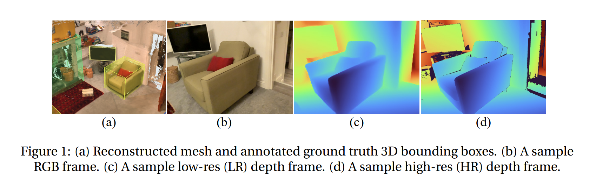
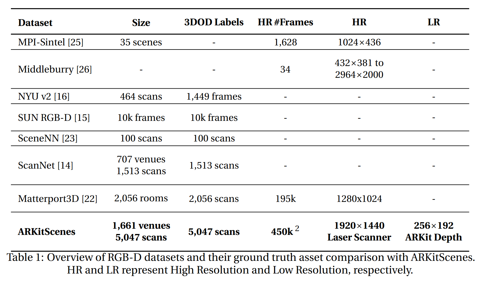
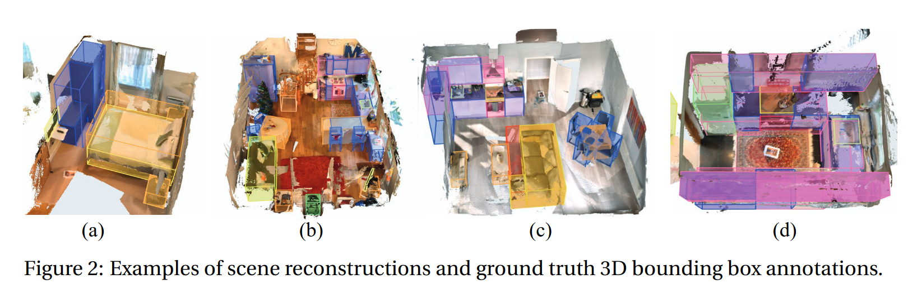

# ARKitScenes: A Diverse Real-World Dataset For 3D Indoor Scene Understanding Using Mobile RGB-D Data

Gilad Baruch, Zhuoyuan Chen, Afshin Dehghan, Tal Dimry, Yuri Feigin, Peter Fu, Thomas Gebauer, Brandon Joffe, Daniel Kurz, Arik Schwartz, Elad Shulman (2022)
[View Paper](https://doi.org/10.48550/arXiv.2111.08897)

Right now, my notes still have this callout-note thing. In theory, though, I take these important passages, summarize and synthesize its content into my own words.

Testing writing here.

$$
f(x) = \int_0^1e^{-x^2}dx
$$

This project is related to [Scan2CAD: Learning CAD Model Alignment in RGB-D Scans](avetisyanScan2CADLearningCAD2018.html). Let's see if this is still an ugly link on the page.

> [!note]
> This is a note callout

> [!margin]
> This becomes a side note in our workflow

In addition to the raw and processed data from the mobile device, ARKitScenes includes high resolution depth maps captured using a stationary laser scanner, as well as manually labeled 3D oriented bounding boxes for a large taxonomy of furniture.

ARKitScenes, consist of 5,048 RGB-D sequences

These sequences include 1,661 unique scenes.

We used two main devices for data collection: The 2020 iPad Pro and Faro Focus S70. The 2020 iPad Pro is used to collect various sensor outputs such as IMU, RGB (for both Wide and Ultra Wide cameras) as well as the dense depth map from the LiDAR scanner via ARKit. We use the official ARKit SDK3 to collect such information.

Our data collection app runs ARKit world tracking and scene reconstruction during the capture. This is to provide live feedback to the operators, who are not computer vision experts, on tracking robustness and reconstruction quality. In addition to the handheld iPad Pro we utilized a Faro Focus S70 stationary laser scanner on a tripod to collect high-resolution XYZRGB point clouds of the environment.

Data is collected in three major cities in Europe, London, Newcastle, and Warsaw.

the socioeconomic status (SES) of the household as well as the location of the house in the city.

rural, suburban, and urban location

irst, we use a Faro Focus S70 stationary laser scanner on a tripod to collect highly accurate XYZRGB point clouds of the environment. Tripod locations are chosen to maximize surface coverage, and on average we collected four laser scans per room to ensure good coverage. Second, we record up to three video sequences attempting to capture all surfaces in each room using the iPad Pro.

environment completely static

inconsistent illumination between the different sequences and scans.

3D object bounding boxes. We use a custom tool to manually annotate 3D oriented bounding boxes for 17 categories of room-defining furniture.
